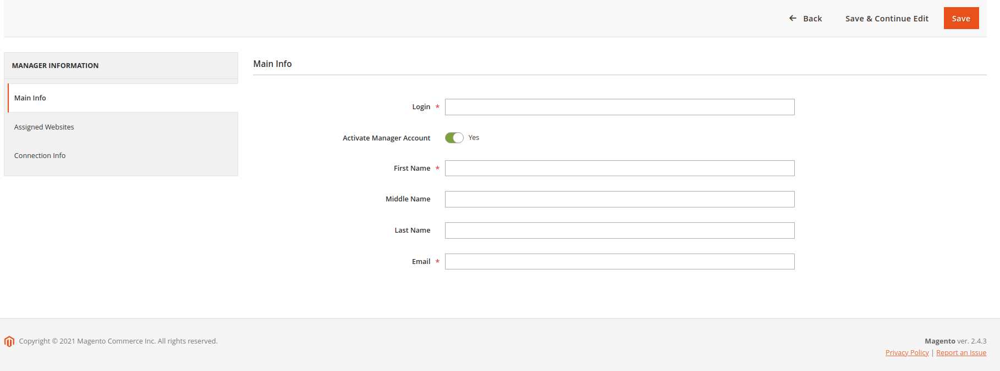
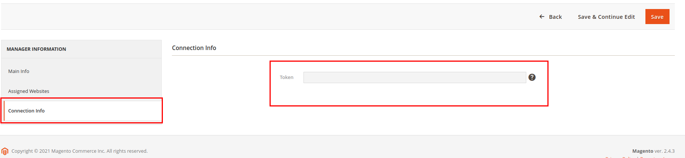
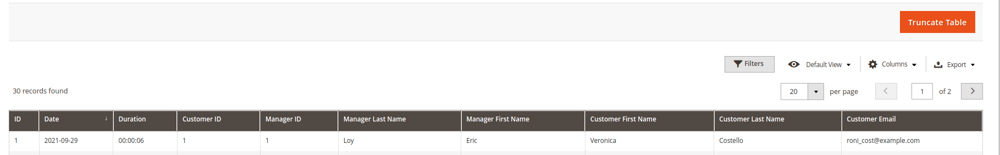
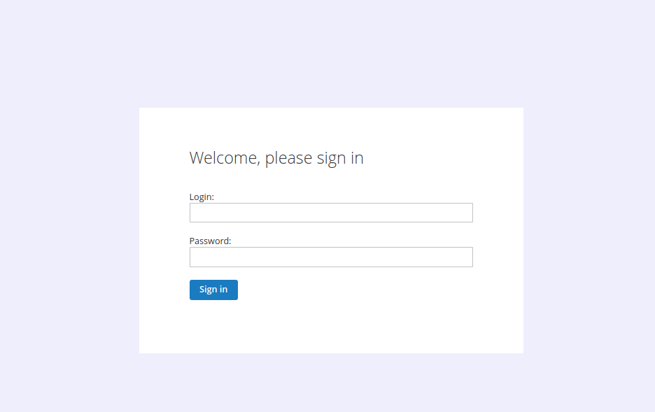
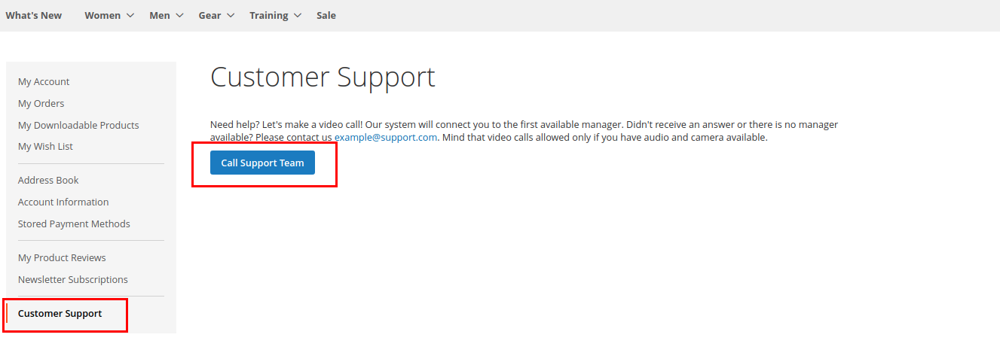
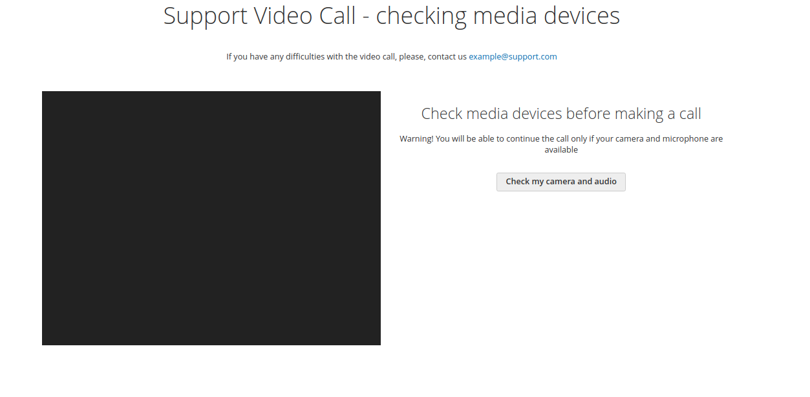

# Magento 2 Video Call Module

You use this module on your risk!

## Overview
Magento 2 Video Call module allows you to make video call between a client and a support manager without any additional 3d-party applications.

Everything that you need is your Magento shop installation and an available camera with a microphone.

The Module can automatically check if a camera and a microphone are available for the customer before making a video call.

The video call page supports the following features: mute audio, mute video, hang up, screen sharing.

Each manager can see their call history. In admin panel you are free to see the call history for all managers.


## Installation

Use composer installation! It will install all required dependencies. E.g. in your composer file:


```
"repositories": [
        {
            "type": "composer",
            "url": "https://repo.magento.com/"
        },
        {
            "type": "git",
            "url": "[URL_TO_YOUR_GIT]"
        }
```

After run:

```
    composer require belsmol/module-videocall
    bin/magento module:enable BelSmol_VideoCall
    bin/magento setup:upgrade
    bin/magento setup:di:compile
    bin/magento setup:static-content:deploy
```

<strong>Don't forget to enable the module in your admin panel!</strong>


## Admin Config Settings

Go to admin panel

```
Stores -> Configuration -> Belsmol -> Video Call
```

There are 6 setting tabs for the Module.

1) General Settings - general tab which allows you to enable/disable module

2) Security Settings - manage session lifetime for manager account

3) WebRTC Settings - settings for real time connection.

    - Webrtc Adapter Url - url for adapter

    - Signaling Server Host - host for server. Eg: ws://0.0.0.0 or wss://0.0.0.0 - where wss is https protocol.
        If you use docker, then you can run "docker inpect [container]" and take IP of the container

    - Signaling Server Port - port for server

    - Check Signaling By Cron - the settings adds a cron job what will check signaling server status and restart server if need

    - Cron Schedule - schedule when to run the cron

4) Stun/Turn Settings (Ice Servers) - credentials to your server. Eg. turn:my.server.com. If your server doesn't require user and pass then leave them empty

5) Email Settings

    - Email From - this email will be used as an email sender for sending generated password to a manager

    - Name From - this name will be used as an email sender name

6) Customer Account Settings

    - Support Email - this email will be used by users in case of call problems


After you set all the data, run manually or by cron:

```
    php bin/magento belsmol-video-call:signaling:start
```

WARNING! Run this command in background. No output here.

## Admin Manager
The module has possibility to manage managers accounts. You can run all CRUD operations with the manager entity.

Go to admin panel

```
VideoCall -> All Managers
```



Feel free to fill all manager data. <b>WARNING! The manager password will be generated automatically and sent to a manager's email.
Make sure you have setted up your smtp settings correctly. If error occured, you can always change a manager pass using CLI</b>

The manager edit page has the tab "Connection info". Token will be generated automatically and used as parameter for call accessing.




## Admin Call History

You can see the entire call history in one place

Go to admin panel

```
VideoCall -> Call History
```



## Cli Command Overview
The Module supports the following list of cli commands:
1) Change manager password

```
   php bin/magento belsmol-video-call:manager:change-pass --email=manage@email.com --password=123456
```

2) Run Signaling server - <b>WARNING!</b> - Use the command in test purpose. For background process please run cron:run.

```
   php bin/magento belsmol-video-call:signaling:start 
```

If everything is Ok then after running the command you will see endless cursor blinking. Press ctr+C to stop the command.
If the server was already runt then you will get appropriate message.

<b>Please, mind the following:</b> when signaling server is run you can see the process name using "top" command in terminal (Linux)


3) Stop Signaling Server
```
   php bin/magento belsmol-video-call:signaling:stop 
```

## Manager Account Overview
Open the following url address in you shop: domain/videocall/manager/login

Log in to manager account and start getting the clients call requests



Dashboard contains the list of calls queue. Click the "join" link to join a call.

## Customer Account Overview
Log in as a customer and proceed to "My account". In the left sidebar you can click the "Customer Support" link and join a call with a manager.



Before being redirected to a call, the Module needs to check the camera and microphone. After checks the user get either an error or will be redirected to the call page.




## System requirements:

1) Available camera and microphone - Make sure that managers have the camera and microphone available. Customers will check their devices using module functionality
2) phpRatchet installed - Needs to be installed separately if the Module installation will be without composer
3) SSL Certificate - WebRTC doesn’t work without https protocol
4) TURN / STUN server - You can use your own server (see <a href="https://github.com/coturn/coturn">COTURN</a>) or use already existing servers (may be not secure)
5) Magento >= 2.4.3 and PHP >= 7.4 - You can use Magento from 2.4.0 to 2.4.2 if php 7.4 is used
6) Browser support - Please, see the list of <a href="https://en.wikipedia.org/wiki/WebRTC#Support">supported browsers</a>

<b>WARNING!</b> add to csp_whitelist.xml in <connect-src> node your websocket address and TURN/STUN address

## Debug on local machine:
WebRTC doesn't work without ssl certificate. If you need to debug calls, please, set the flag in Google Chrome.
Open the link below and put your local domain in "Insecure origins treated as secure" field.

FOR GOOGLE CHROME:

```
   chrome://flags/#unsafely-treat-insecure-origin-as-secure
```


FOR MOZILLA:

```
   - go to about:config.
   - set to "true" media.devices.insecure.enabled and media.getusermedia.insecure.enabled
```

